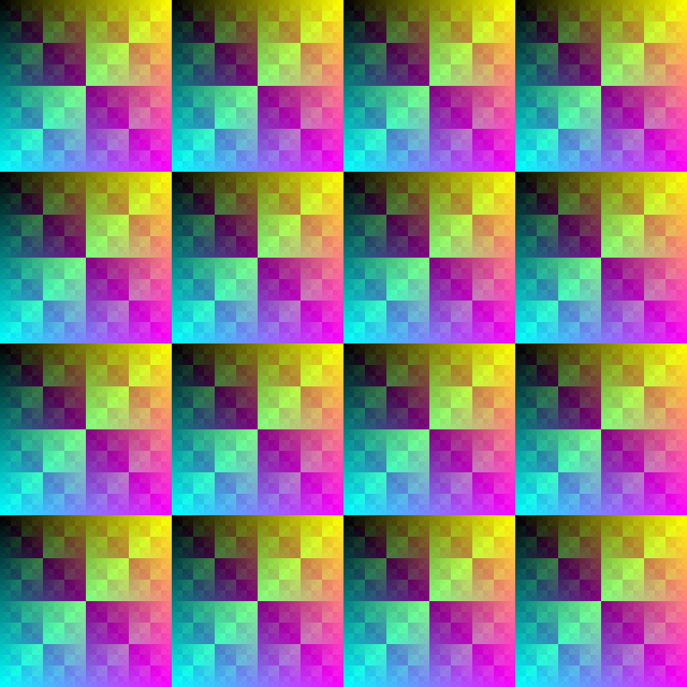

# Gradexor - 排他的論理和色彩変化画像
Copyright (C) 2020-2024 Takym.

## 概要
本リポジトリで配布しているプログラムは XOR 演算等を用いたグラデーションを描画します。
[aclib](http://essen.osask.jp/?aclib05) 版と C# 静的版の二つのバージョンがあります。
前者は出力できる画像の種類が多いです。

## 別プロジェクトの一覧
本リポジトリは、新しいリポジトリを作るまでもない別のプロジェクトを格納しています。
「(@)」が付いているプロジェクトは、元々、独立した別のリポジトリで管理していましたが、本リポジトリに統合しました。

* **[AclibMarkup](./AclibMarkup)** (@)
	* [aclib](http://essen.osask.jp/?aclib05) を用いたコードを生成するマークアップ言語です。
	* [元のリポジトリ](https://github.com/Takym/AclibMarkup)
* **[BinFuck](./BinFuck)** (@)
	* [Brainfuck](https://ja.wikipedia.org/wiki/Brainfuck) を参考に開発した難解プログラミング言語です。
	* [元のリポジトリ](https://github.com/Takym/BinFuck)
	<!-- 次の文章は追加すべきか？「Brainfuck から ra の文字が消えているので Brainfuck Nora ともいう」 -->
* **[MBRInfo](./misc/sfp/MBRInfo.c)**
	* MBR の情報を表示するプログラムです。
	* BPB と FAT 12/16/32 のヘッダーとパーティションテーブルの情報を表示します。
	* 現在のバージョンでは IPL は表示できません。
* **[HeliocentrismAndGeocentrism](./HeliocentrismAndGeocentrism/)** (@)
	* 地動説で見た時の星々の動きと天動説で見た時の星々の動きをシミュレーションします。
	* [元のリポジトリ](https://github.com/Takym/HeliocentrismAndGeocentrism)
* **[JsonUrlSaver](./JsonUrlSaver/)**
	* JSON ファイル内の URL から資源をダウンロードして保存するツールです。
* **[CppRepl](./misc/sfp/CppRepl.cpp)**
	* C++ を REPL 実行できる簡易的なプログラムです。
* **[Vuuzwaail](./misc/Vuuzwaail/)**
	* 独自設計の仮想機械です。
* **[実験](./misc/labs/)**
	* プログラミングの実験用ディレクトリです。

## ブランチ一覧
* [master](https://github.com/Takym/Gradexor/tree/master) - 最新のソースを保管しています。
* [Legacy/Gradexor](https://github.com/Takym/Gradexor/tree/Legacy/Gradexor) - 古い **Gradexor** を保管しています。
* [Legacy/AclibMarkup](https://github.com/Takym/Gradexor/tree/Legacy/AclibMarkup) - 古い **AclibMarkup** を保管しています。
* [Legacy/BinFuck](https://github.com/Takym/Gradexor/tree/Legacy/BinFuck) - 古い **BinFuck** を保管しています。
* [Legacy/HeliocentrismAndGeocentrism](https://github.com/Takym/Gradexor/tree/Legacy/HeliocentrismAndGeocentrism) - 古い **HeliocentrismAndGeocentrism** を保管しています。

## 画面
ここではグラデーションのスクリーンショットを紹介します。

### Types
**Types** を [VcXsrv](https://sourceforge.net/projects/vcxsrv/) 経由で WSL から起動した例です。

[](./Screenshots/Types.png)

### Sanko「三湖」（バージョン１）
三角形の模様が変化していくのが特徴です。
* [動画をダウンロードする](./Screenshots/Sanko.mp4?raw=true)。

### C#静的版
C# で実装した Gradexor を使うと、以下の様な画像が出力されます。

[](./Screenshots/gradexor_static_output.png)

## 起動方法
0. `bash` を開きます。
	* **Windows** を使用している場合は WSL を開いてください。
1. このリポジトリをクローンします。
	* `git clone https://github.com/Takym/Gradexor.git & cd Gradexor/src`
2. <http://essen.osask.jp/?aclib05> から最新の **aclib** をダウンロードして `Gradexor/lib` ディレクトリにコピーします。
	* この手順は飛ばしても構いません。
3. 下記のコマンドを実行し、SDL 2.0 をインストールします。
	> ```sh
	> $ sudo apt install libsdl2-dev
	> ```
4. `./gradexor.build.sh` を実行してビルドします。
5. `./gradexor.run_all.sh` を実行します。
	* このコマンドを実行すると、全種類のグラデーションプログラムが順番に起動します。

## 主な問題点
* [#2: プログラムを整理・最適化する。](https://github.com/Takym/Gradexor/issues/2)

## 謝辞
このプログラムでは [aclib](http://essen.osask.jp/?aclib05) を利用しています。
製作者の川合秀実さんにこの場を借りてお礼申し上げます。ありがとうございます。
**aclib** は[KL-01ライセンス](http://web.archive.org/web/20040402101233/http://www.imasy.org/~mone/kawaido/license01-1.0.html)に基づいて配布されています。

## 利用ライブラリ
* [aclib](http://essen.osask.jp/?aclib05)
	* 著作者：川合秀実
	* 使用許諾：[KL-01ライセンス](http://web.archive.org/web/20040402101233/http://www.imasy.org/~mone/kawaido/license01-1.0.html)
* [SDL 2.0](https://www.libsdl.org/download-2.0.php)
	* 著作権表記：Copyright (C) 1997-2022 Sam Lantinga <slouken@libsdl.org>
	* 使用許諾：[zlib License](https://github.com/libsdl-org/SDL/blob/main/LICENSE.txt)
	* リポジトリ：<https://github.com/libsdl-org/SDL>
* **System.Drawing**
	* .NET 5 以上
		* 著作権表記：Copyright (c) .NET Foundation and Contributors
		* 使用許諾：[The MIT License](https://github.com/dotnet/runtime/blob/main/LICENSE.TXT)
		* リポジトリ：<https://github.com/dotnet/runtime>
		* パッケージ：<https://www.nuget.org/packages/System.Drawing.Common/>
	* .NET Framework 4.5 以上
		* 情報収集中
* **Microsoft.NET.Sdk**
	* [.NET プロジェクト SDK](https://docs.microsoft.com/ja-jp/dotnet/core/project-sdk/overview)
	* 著作権表記：Copyright (c) .NET Foundation and Contributors
	* リポジトリ：<https://github.com/dotnet/sdk>
	* 使用許諾：[MITライセンス](https://github.com/dotnet/sdk/blob/main/LICENSE.TXT)

## 利用規約
このプログラムは[MITライセンス](./LICENSE.md)に基づいて配布されています。

このリポジトリには複数のライセンスファイルが添付されていますが、全て**MITライセンス**になっています。
複数のリポジトリを統合したためこの様になっています。
<!--（将来、再び別のリポジトリを統合した場合、もしかしたら、異なるライセンスのファイルが混入するかもしれません。）-->
